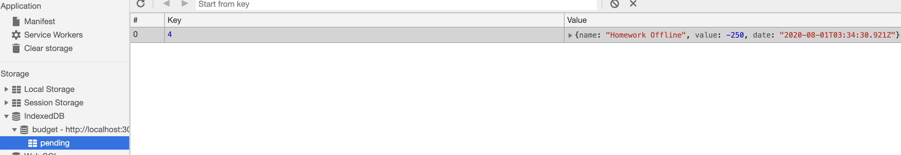

# Budget-Tracker

## Description

This application will allow the user to maintain and update a budget while both online and offline.

___

## How it Works

This application begins with the user using the npm command to kickoff the application. From here the user will need to open localhost:3000 in the browser.

When the application opens the user will see the budget tracker application.

  

  

The application gives the user the opportunity to enter a new transaction name, a transation amount, and also decide whether to add or subtract funds from the overall total. Once these values are entered into the tracker, the graph will display the trend of the data. The y-axis indicates the total and the x-axis displays the date in which the transaction was added.

The next feature of this application is its ability to be used while offline.  In order to go into an offline status, the user will need to open up the inspector tools, select "service worker", and check the "Offline" box on the screen. The service worker is created from the service-worker.js file and provides the application the necessary information to know which files need to be caches while the application functions offline.

  

  

The user can now input a transation while in the offline state. For this example, the user is attempting to post a -$250 transaction entitled "Homework Offline":

  

  

When the tracker is used offline the indexedDB holds that information in a pending state in the cached area. Any transaction done during this time will appear as below:

  

  

While in this state, the user will also be able to look at the caches storage. This is the information that is being stored while offline based on the requested caches files in the service-worker.js file.

  

  

After the user has completed the transaction, he/she will be able to test the functionality by placing the application back in an online state by simply unclicking the offline button that was previously selected. By doing this step and refreshing the page, the user will be able to see that the pending transtion is no longer showing in the indexedDb section of the inspector tools. Along with this updated, the user will also be able to see that their new transaction has been successfully added to the list of overall transaction for this appliction.

  

  

The user is now able to free switch between an online and offline state without any interuption with functionality of the application.

  
___

### Links for Heroku Deployment and GitHubDeployment
 
Heroku: https://budget-tracker12345.herokuapp.com/
  
GitHub: https://github.com/ccraig7321/Budget-Tracker
  
Portfolio Link: https://ccraig7321.github.io/Responsive-Portfolio/

### License

Copyright 2020 CHELSEY CRAIG

Permission is hereby granted, free of charge, to any person obtaining a copy of this software and associated documentation files (the "Software"), to deal in the Software without restriction, including without limitation the rights to use, copy, modify, merge, publish, distribute, sublicense, and/or sell copies of the Software, and to permit persons to whom the Software is furnished to do so, subject to the following conditions:

The above copyright notice and this permission notice shall be included in all copies or substantial portions of the Software.

THE SOFTWARE IS PROVIDED "AS IS", WITHOUT WARRANTY OF ANY KIND, EXPRESS OR IMPLIED, INCLUDING BUT NOT LIMITED TO THE WARRANTIES OF MERCHANTABILITY, FITNESS FOR A PARTICULAR PURPOSE AND NONINFRINGEMENT. IN NO EVENT SHALL THE AUTHORS OR COPYRIGHT HOLDERS BE LIABLE FOR ANY CLAIM, DAMAGES OR OTHER LIABILITY, WHETHER IN AN ACTION OF CONTRACT, TORT OR OTHERWISE, ARISING FROM, OUT OF OR IN CONNECTION WITH THE SOFTWARE OR THE USE OR OTHER DEALINGS IN THE SOFTWARE.

___